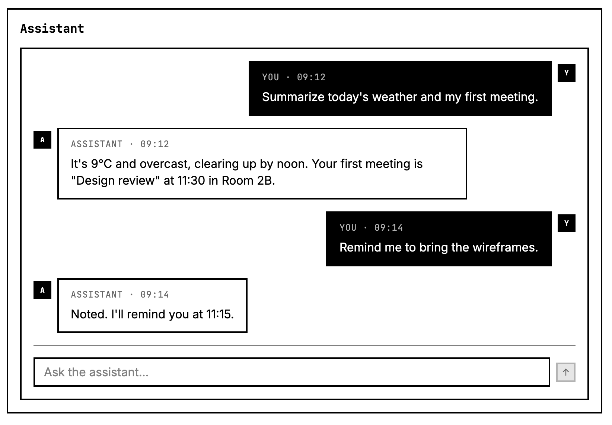
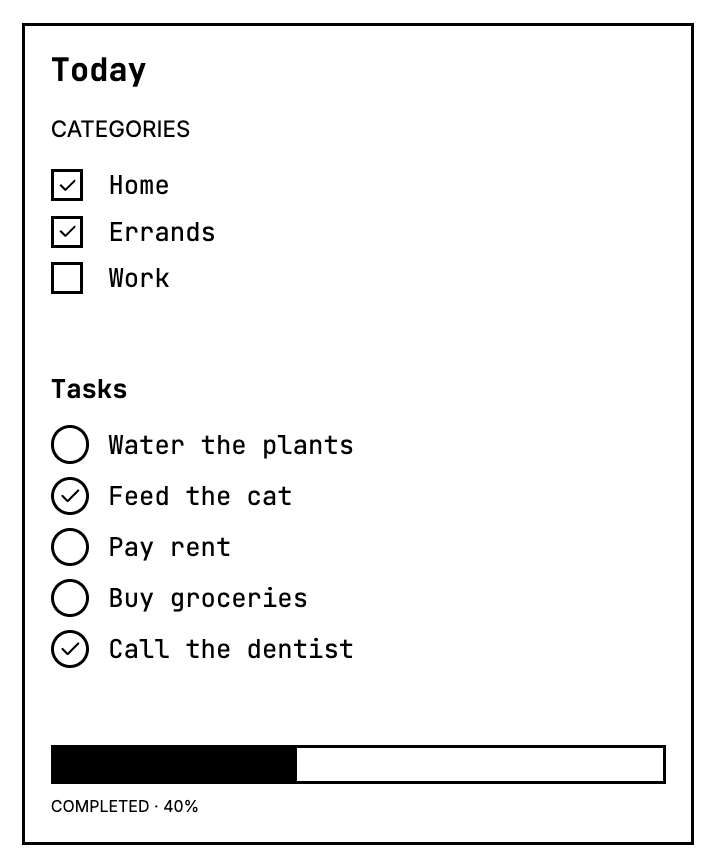
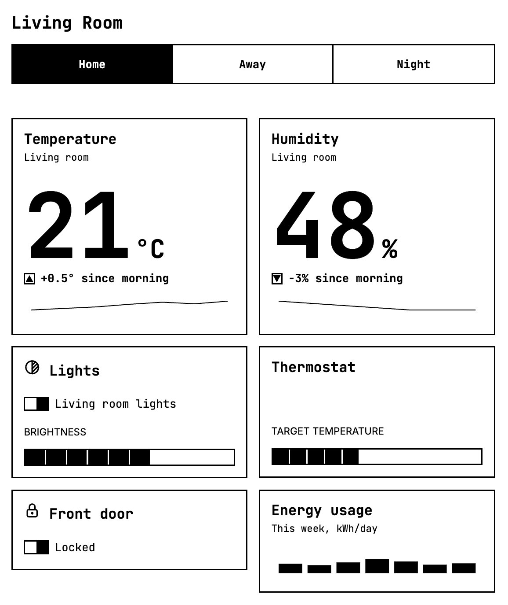
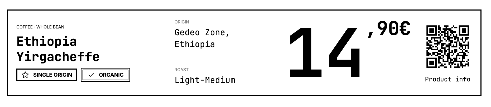
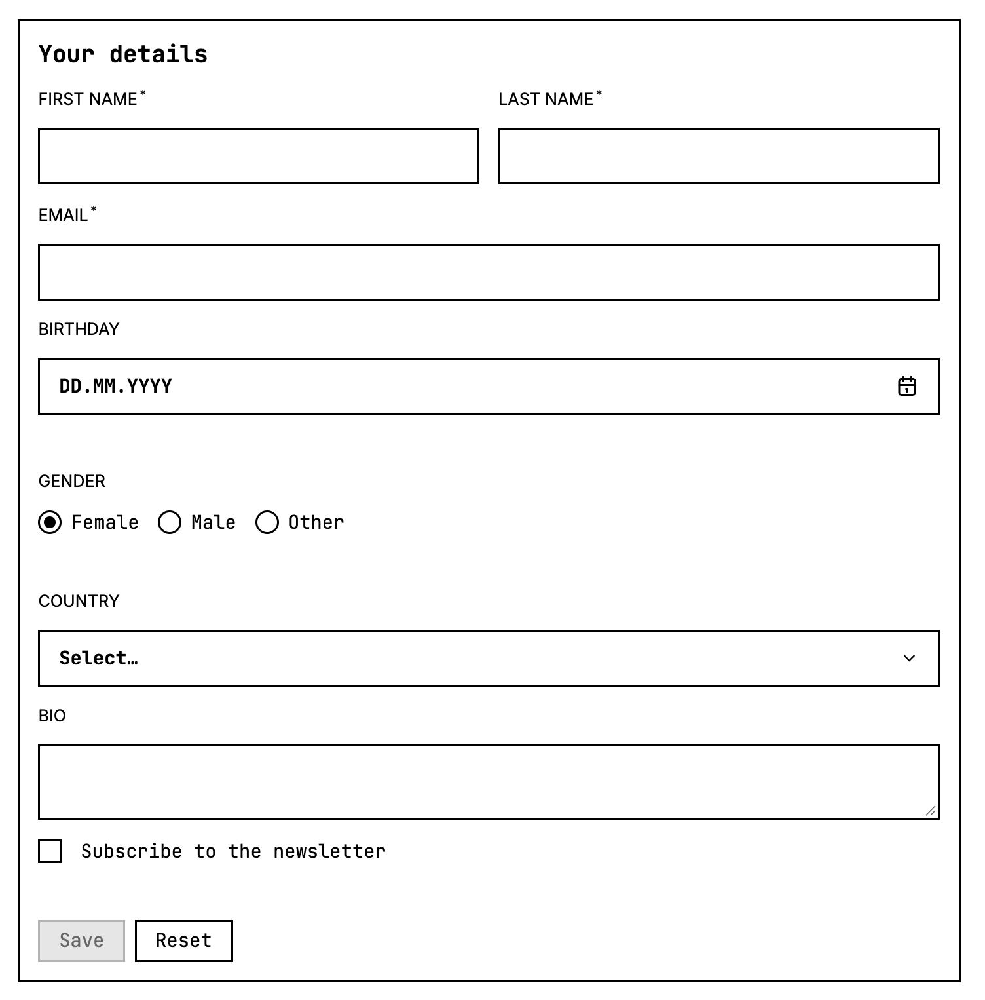

# e-ink-ui-lib

[](https://github.com/AlexisRoe/e-ink-ui-lib/actions/workflows/pr.yml)
[](https://www.npmjs.com/package/e-ink-ui-lib)
[](LICENSE)

My first very own UI library. This one is meant for e-ink screen tablets and devices, built with React. Its intentionally built for e-ink tablet like a Boox Lumi II. If you want to develop for integrated e-ink displays (e.x. ESP32), please have a look into [Marco Mattes cool library](https://epaper-components.dev/) for e-ink ready components.

75+ components across Actions, Data Display, Forms, Layout and Typography — browse them all, plus full
application examples, in Storybook (`npm run storybook`).



## Contents

- [e-ink-ui-lib](#e-ink-ui-lib)
  - [Contents](#contents)
  - [Motivation](#motivation)
  - [Screenshots](#screenshots)
  - [How to start](#how-to-start)
    - [Local development and testing](#local-development-and-testing)
    - [Integrating into your own project](#integrating-into-your-own-project)
  - [Technologies](#technologies)
  - [Architecture](#architecture)
  - [Contributing](#contributing)
  - [Acknowledgements](#acknowledgements)
  - [License](#license)

## Motivation

To be honest, it started when I got my Boox Lumi e-ink tablet. Creating my first application with [e-ink library by Marco Mattes](https://epaper-components.dev/). Than I wanted to use native components in react. The library is heavenly influced by his library of awesome components, honestly have a look. But also working with [Mantine](https://mantine.dev/getting-started/) and [shadcn](https://ui.shadcn.com/) had a big influence how I did things here.

Since Mantine or shadcn, seem to be a bit to heavy for low powered android based e-ink tablets or devices, I developed this lib.

E-ink displays are not just "low-color screens" — they refresh slowly, render only greys, and have no
meaningful concept of hover states, transitions, or color-coded UI. Most component libraries assume an
LCD/OLED panel and quietly break these assumptions once they hit real e-ink hardware.

`e-ink-ui-lib` exists to give e-ink tablet and device projects a set of components that are designed
around those constraints from the start, instead of bolting a "dark mode" or greyscale filter onto a
library that was never meant for it.

## Screenshots

| Todo app                                              | Smart-home dashboard                                                          |
| ----------------------------------------------------- | ----------------------------------------------------------------------------- |
|  |  |

| Shelf label                                                 | User data form                                               |
| ----------------------------------------------------------- | ------------------------------------------------------------ |
|  |  |

More composite examples (meeting room sign, hotel room sign, parcel tracking, multi-page document, …)
live in Storybook under **Applications**.

## How to start

### Local development and testing

Requires Node.js `>=24.17.0`.

```bash
git clone https://github.com/AlexisRoe/e-ink-ui-lib.git
cd e-ink-ui-lib
npm ci
npm run storybook
```

### Integrating into your own project

To use the library in another project once published:

```bash
npm install e-ink-ui-lib
```

```tsx
import { ThemeProvider, Button, Card, Value, Trend } from "e-ink-ui-lib";
import "e-ink-ui-lib/style.css";

function App() {
  return (
    <ThemeProvider>
      <Card>
        <Card.Header>
          <Card.Title>Living room</Card.Title>
        </Card.Header>
        <Card.Content>
          <Value unit="°C" size="xl">21</Value>
          <Trend direction="up" size="sm">+0.5° since morning</Trend>
          <Button fullWidth>Refresh</Button>
        </Card.Content>
      </Card>
    </ThemeProvider>
  );
}
```

For more realistic, full-screen compositions like this one, see `Applications/Smart Home Dashboard` and
the other stories under **Applications** in Storybook.

## Technologies

- [React](https://react.dev/) 19 + TypeScript
- [Vite](https://vitejs.dev/) for the dev server and library build (`vite-plugin-dts` for type declarations)
- [Storybook](https://storybook.js.org/) 10 for component docs/examples, deployed via [Wrangler](https://developers.cloudflare.com/workers/wrangler/) (Cloudflare Workers)
- [Vitest](https://vitest.dev/) + [Testing Library](https://testing-library.com/) for unit tests
- [Biome](https://biomejs.dev/) for linting and formatting
- [@tabler/icons-react](https://tabler.io/icons), [jsbarcode](https://github.com/lindell/JsBarcode), [qrcode-generator](https://github.com/kazuhikoarase/qrcode-generator) for icons, barcodes and QR codes

## Architecture

- **`src/components/<name>/`** — one folder per component: `*.component.tsx` (implementation),
  `*.component.css` (styles), `*.test.tsx` (Vitest tests), `*.stories.tsx` (Storybook stories). Each
  component is self-contained and only exports what's needed through `src/index.ts`, which is the
  library's public API surface.
- **`src/applications/`** — composite example stories (AI chat, todo app, smart-home dashboard, shelf
  label, meeting room sign, hotel room sign, parcel tracking, multi-page document, user data form) built
  entirely from the exported components, showing how they combine in realistic screens.
- **`src/utils/`** — framework-agnostic helpers (e.g. the `cx` className-merge helper, form validators),
  not part of the public API unless re-exported.
- **`src/hooks/`** — one folder per hook (`use-foo/use-foo.hook.ts` + `use-foo.hook.test.ts`), 26
  dependency-free React hooks exported from `src/index.ts` alongside the components.
- **`src/tokens/`** — design tokens (`--eink-size-*`, `--eink-color-*`, `--eink-border-*`) documented as
  Storybook pages; every component styles itself from these tokens instead of hardcoded values.
- **Theme** — `src/components/theme/` exposes `ThemeProvider`/`useTheme` and `theme.css`, which forces
  the whole tree to greyscale (`filter: grayscale(100%)`) so components look correct in the browser even
  before an actual e-ink panel does its own conversion.

```
src/
├── components/
│   └── <name>/
│       ├── <name>.component.tsx
│       ├── <name>.component.css
│       ├── <name>.test.tsx
│       └── <name>.stories.tsx
├── applications/        # composite example stories
├── hooks/
│   └── use-<name>/
│       ├── use-<name>.hook.ts
│       └── use-<name>.hook.test.ts
├── utils/
│   ├── <name>.utils.ts
│   └── <name>.utils.test.ts
├── tokens/               # design token Storybook pages
├── About.mdx
└── index.ts              # public API surface
```

## Contributing

1. **Open an issue first** — describe in your own words what you want to change and why. Once you've
   been added as a contributor, you'll be able to open a pull request for it.
2. Fork/branch, make your change, and run the checks locally:

   ```bash
   npm run typecheck && npm test && npm run lint
   ```

3. Open a pull request against `main`. Every PR runs lint, test and build checks in CI (see the badge
   above) — keep them green before asking for review.

A few conventions to follow along the way:

- One folder per component under `src/components/<name>/`, following the naming convention above.
- Use BEM-style CSS classes prefixed `eink-` (`.eink-button`, `.eink-button__icon`, `.eink-button--filled`)
  and always style from the design tokens in `theme.css` — never hardcode sizes, colors, or borders.
- Every exported component/prop needs a short JSDoc description; non-trivial components should include an
  `@example`. Every component needs a `.stories.tsx` under `Components/<Group>/<Name>` with `tags: ["autodocs"]`.
- Use the shared `cx` helper (`src/utils/cx.utils.ts`) for conditional class merging instead of
  reimplementing it.
- See [`CLAUDE.md`](CLAUDE.md) for the full set of project conventions — it's the same file Claude Code
  reads before touching this repo, so it's kept up to date.

## Acknowledgements

- [Marco Matte's epaper-components](https://epaper-components.dev/) — the library that got me hooked on
  building for e-ink in the first place, and a direct influence on this one. If you're targeting
  integrated e-ink displays (ESP32 and similar), go there instead.
- [Mantine](https://mantine.dev/getting-started/) and [shadcn/ui](https://ui.shadcn.com/) — for API and
  component-design inspiration, scaled down for low-powered e-ink hardware.
- [uidotdev/usehooks](https://github.com/uidotdev/usehooks) (ui.dev) — the 26 hooks under `src/hooks/`
  are adapted from this MIT-licensed collection, which saved a lot of time reinventing well-tested React
  hooks from scratch. Go give it a star.

## License

[MIT](LICENSE) © Alexis Roehrling
